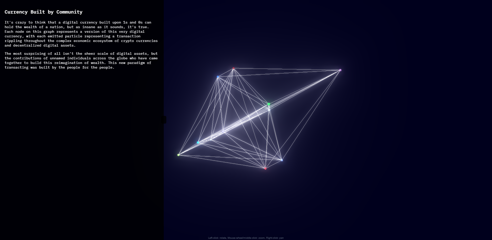

# Wormhole Tracker

A real-time visualization of Wormhole blockchain transactions using 3D Force Graph.



## Project Structure

```
wormhole-tracker/
├── backend/           # C++ WebSocket server
│   ├── CMakeLists.txt
│   ├── main.cpp
│   └── Dockerfile
├── frontend/         # Web frontend
│   ├── index.html
│   ├── script.js
│   ├── styles.css
│   ├── package.json
│   └── package-lock.json
└── render.yaml       # Render deployment configuration
```

## Local Development

### Backend Setup

1. Install dependencies:
   ```bash
   cd backend
   mkdir build && cd build
   cmake ..
   make
   ```

2. Run the server:
   ```bash
   ./wormhole_tracker
   ```

### Frontend Setup

1. Install dependencies:
   ```bash
   cd frontend
   npm install
   ```

2. Serve the frontend:
   ```bash
   # Using Python's built-in server
   python3 -m http.server 8000
   ```

## Deployment

This project is configured for deployment on [Render](https://render.com/). The `render.yaml` file defines two services:

1. `wormhole-tracker-backend`: A Docker-based WebSocket server
2. `wormhole-tracker-frontend`: A static site serving the visualization

To deploy:

1. Push your code to a Git repository
2. Connect the repository to Render
3. Render will automatically deploy both services using the configuration in `render.yaml`

## Technologies Used

- Backend:
  - C++
  - uWebSockets
  - CPR (C++ Requests)
  - nlohmann/json

- Frontend:
  - 3D Force Graph
  - WebSocket
  - Three.js 
